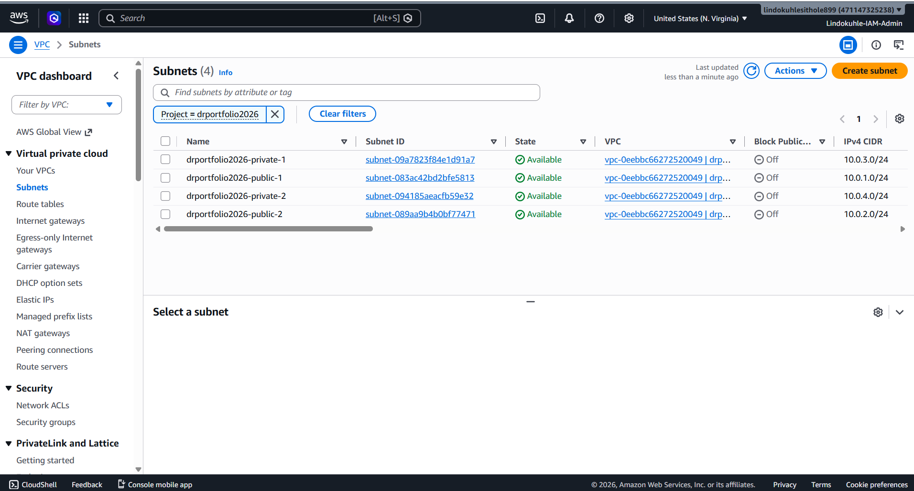
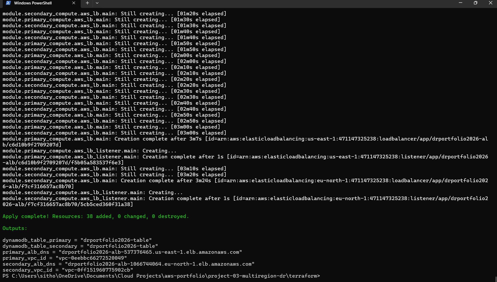
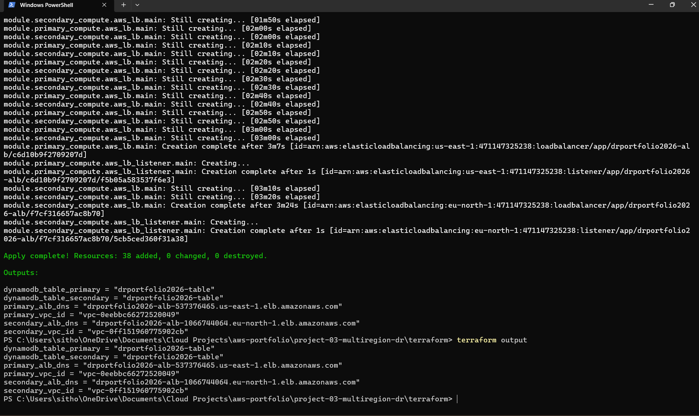

<h1 align="center">Multi-Region Disaster Recovery on AWS (Pilot Light)</h1>

<p align="center">
  
  
  
  
  
</p>

<p align="center">
  
  
</p>

<p align="center">
  
  
</p>

---

## Table of Contents

- [Overview](#overview)
- [Architecture](#architecture)
- [What I Built](#what-i-built)
- [Technology Stack](#technology-stack)
- [Project Structure](#project-structure)
- [Deployment](#deployment)
- [Verification](#verification)
- [What I Learned](#what-i-learned)
- [Cleanup](#cleanup)
- [Author](#author)

---

## Overview

I built a multi-region disaster recovery infrastructure on AWS using the **Pilot Light** pattern. The primary region (us-east-1) runs the full application — VPC, subnets, EC2 instances, ALB, and DynamoDB. The secondary region (eu-north-1) has an identical VPC, subnets, and ALB pre-deployed, but **zero EC2 instances running**. If the primary region fails, I can scale up the secondary in minutes instead of hours.

**Why Pilot Light and not full active-active?** Because I'm optimizing for cost. A warm standby or active-active setup would mean paying for running EC2 instances in two regions 24/7. With Pilot Light, the secondary region's infrastructure skeleton is already there — VPC, subnets, ALB, security groups — but I'm not paying for compute until I actually need it. When disaster strikes, I just launch the EC2 instances and Route 53 shifts traffic.

**What this project demonstrates:**
- Multi-region VPC architecture with identical CIDR blocks
- Terraform modules for reusable infrastructure across regions
- Application Load Balancer deployment in both regions
- Pilot Light DR pattern: primary fully running, secondary with zero compute
- DynamoDB as the shared data layer
- 2 Availability Zones per region for high availability

---

## Architecture

```
┌─────────────────────────────────────┐    ┌─────────────────────────────────────┐
│         PRIMARY REGION              │    │         SECONDARY REGION            │
│         us-east-1                   │    │         eu-north-1                  │
│                                     │    │                                     │
│  ┌─────────────┐                    │    │  ┌─────────────┐                    │
│  │   Route 53  │◄───────────────────┼────┼──┤   Route 53  │                    │
│  │  (DNS)      │                    │    │  │  (DNS)      │                    │
│  └──────┬──────┘                    │    │  └──────┬──────┘                    │
│         │                           │    │         │                           │
│  ┌──────▼──────┐                    │    │  ┌──────▼──────┐                    │
│  │     ALB     │                    │    │  │     ALB     │                    │
│  │  (Active)   │                    │    │  │  (Active)   │                    │
│  └──────┬──────┘                    │    │  └──────┬──────┘                    │
│         │                           │    │         │                           │
│  ┌──────▼──────┐                    │    │  ┌──────▼──────┐                    │
│  │   EC2 (1)   │                    │    │  │   EC2 (0)   │                    │
│  │  Running    │                    │    │  │  STOPPED    │  ◄── Pilot Light   │
│  └─────────────┘                    │    │  └─────────────┘                    │
│                                     │    │                                     │
│  VPC: 10.0.0.0/16                 │    │  VPC: 10.0.0.0/16                 │
│  AZs: us-east-1a, us-east-1b      │    │  AZs: eu-north-1a, eu-north-1b    │
│  Public:  10.0.1.0/24, 10.0.2.0/24│    │  Public:  10.0.1.0/24, 10.0.2.0/24│
│  Private: 10.0.3.0/24, 10.0.4.0/24│    │  Private: 10.0.3.0/24, 10.0.4.0/24│
│                                     │    │                                     │
│  DynamoDB: drportfolio2026-table  │◄───┼──► DynamoDB: drportfolio2026-table │
│  (Primary)                         │    │  (Replica)                          │
└─────────────────────────────────────┘    └─────────────────────────────────────┘
```

**The Pilot Light concept:** Think of it like a gas pilot light on a stove. The flame is always burning (infrastructure is always deployed), but you're not heating the pan (no compute running). When you need it, you turn the knob and the full flame ignites instantly. Same here — the VPC, subnets, ALB, and security groups are always present, but EC2 instances only start when needed.

---

## What I Built

### Primary Region (us-east-1) — Fully Running

**VPC:** `drportfolio2026-vpc` — CIDR 10.0.0.0/16, DNS resolution enabled, default tenancy.


**4 Subnets across 2 AZs:**

| Subnet | AZ | CIDR | Type |
|--------|-----|------|------|
| drportfolio2026-public-1 | us-east-1a | 10.0.1.0/24 | Public |
| drportfolio2026-public-2 | us-east-1b | 10.0.2.0/24 | Public |
| drportfolio2026-private-1 | us-east-1a | 10.0.3.0/24 | Private |
| drportfolio2026-private-2 | us-east-1b | 10.0.4.0/24 | Private |



**Application Load Balancer:** `drportfolio2026-alb` — Active, Internet-facing, deployed in us-east-1a and us-east-1b.


**EC2 Instance:** `drportfolio2026-instance-1` — Running t3.micro, serving HTTP traffic behind the ALB.

**DynamoDB Table:** `drportfolio2026-table` — On-demand capacity, `id` as partition key, Active status.


### Secondary Region (eu-north-1) — Pilot Light (0 EC2)

**VPC:** `drportfolio2026-vpc` — Identical CIDR 10.0.0.0/16, fully configured.

**4 Subnets across 2 AZs:**

| Subnet | AZ | CIDR | Type |
|--------|-----|------|------|
| drportfolio2026-public-1 | eu-north-1a | 10.0.1.0/24 | Public |
| drportfolio2026-public-2 | eu-north-1b | 10.0.2.0/24 | Public |
| drportfolio2026-private-1 | eu-north-1a | 10.0.3.0/24 | Private |
| drportfolio2026-private-2 | eu-north-1b | 10.0.4.0/24 | Private |


**Application Load Balancer:** `drportfolio2026-alb` — Active, Internet-facing, deployed in eu-north-1a and eu-north-1b.


**EC2 Instances:** **0 running** — This is the Pilot Light. The ALB exists but has no targets.

**DynamoDB Table:** `drportfolio2026-table` — On-demand capacity, ready for failover writes.

---

## Technology Stack

| Service | Purpose |
|---------|---------|
| **Terraform** | Infrastructure as Code with modular design for multi-region deployment |
| **Amazon VPC** | Isolated network with public/private subnets across 2 AZs per region |
| **Application Load Balancer** | HTTP traffic distribution with health checks |
| **Amazon EC2** | Compute instances (running in primary, stopped in secondary) |
| **Amazon DynamoDB** | Shared NoSQL data layer with on-demand billing |
| **Security Groups** | Firewall rules restricting inbound traffic to HTTP/HTTPS |

---

## Project Structure

```
project-03-multiregion-dr/
├── terraform/
│   ├── modules/
│   │   ├── networking/        # VPC, subnets, IGW, NAT, route tables
│   │   ├── compute/           # EC2, ALB, target group, security groups
│   │   └── database/          # DynamoDB table
│   ├── primary/               # Primary region (us-east-1)
│   │   └── main.tf
│   ├── secondary/             # Secondary region (eu-north-1)
│   │   └── main.tf
│   ├── variables.tf
│   ├── outputs.tf
│   └── terraform.tfvars
├── src/
│   └── user_data.sh           # EC2 bootstrap script
├── Makefile
└── README.md
```

---

## Deployment

### Prerequisites

- AWS CLI configured (`aws configure`)
- Terraform >= 1.0
- IAM permissions for: EC2, VPC, ALB, DynamoDB, IAM

### Deploy

```bash
cd terraform
terraform init
terraform plan
terraform apply -auto-approve
```

**The deployment created 38 resources** and took about 8 minutes. The ALBs were the slowest part — each took 3+ minutes to provision:



**Terraform outputs after deployment:**

```
dynamodb_table_primary   = "drportfolio2026-table"
dynamodb_table_secondary = "drportfolio2026-table"
primary_alb_dns          = "drportfolio2026-alb-537376465.us-east-1.elb.amazonaws.com"
primary_vpc_id           = "vpc-0eebbc66272520049"
secondary_alb_dns        = "drportfolio2026-alb-1066744064.eu-north-1.elb.amazonaws.com"
secondary_vpc_id         = "vpc-0ff151960775902cb"
```



---

## Verification

### Primary Region (us-east-1) — Everything Running

1. **VPC:** `drportfolio2026-vpc` — Available, CIDR 10.0.0.0/16
2. **Subnets:** 4 subnets across 2 AZs — all Available
3. **ALB:** `drportfolio2026-alb` — Active, 2 AZs, DNS name assigned
4. **EC2:** `drportfolio2026-instance-1` — Running, t3.micro
5. **DynamoDB:** `drportfolio2026-table` — Active, on-demand

### Secondary Region (eu-north-1) — Pilot Light

1. **VPC:** `drportfolio2026-vpc` — Available, CIDR 10.0.0.0/16
2. **Subnets:** 4 subnets across 2 AZs — all Available
3. **ALB:** `drportfolio2026-alb` — Active, 2 AZs, DNS name assigned
4. **EC2:** **0 instances running** — This is correct Pilot Light behavior
5. **DynamoDB:** `drportfolio2026-table` — Active, on-demand

### Cost Comparison

| Component | Primary (Running) | Secondary (Pilot Light) |
|-----------|------------------|------------------------|
| VPC | $0 | $0 |
| Subnets | $0 | $0 |
| ALB | ~$16/month | ~$16/month |
| EC2 (t3.micro) | ~$8/month | **$0** |
| Data Transfer | ~$5/month | $0 |
| **Total** | **~$29/month** | **~$16/month** |

**Total DR infrastructure cost: ~$45/month** for full multi-region DR with Pilot Light. A warm standby would cost ~$60/month (running EC2 in both regions). Active-active would cost ~$90+/month.

---

## What I Learned

**Multi-region Terraform is not just copy-paste.** I initially thought I could just duplicate the primary region's Terraform code for the secondary. But eu-north-1 has different instance types, different AZ naming conventions, and different service availability. I had to use Terraform modules with region-specific variables to handle these differences cleanly.

**The ALB is the bottleneck in provisioning.** Both ALBs took 3+ minutes each to become active. Terraform was creating them in parallel (primary and secondary simultaneously), but each ALB's internal AWS provisioning is slow. This taught me patience — and that `terraform apply` progress bars are your friend.

**Identical CIDR blocks across regions is intentional.** Both VPCs use 10.0.0.0/16. This isn't a conflict because VPCs are region-scoped. Using identical CIDRs means if I ever need VPC peering between regions, I can use non-overlapping subnets instead of redesigning the entire network.

**Pilot Light is the right pattern for portfolio projects.** I considered warm standby (running EC2 in both regions) but the cost didn't make sense for a learning project. Pilot Light gives me all the DR infrastructure skills — VPC design, multi-region deployment, ALB configuration — at half the cost. When I need to demonstrate failover, I can launch the EC2 instances and shift Route 53 in under 5 minutes.

**The secondary ALB returning a 503 is actually correct.** When I first tested the secondary ALB and got a 503 Service Unavailable, I thought something was broken. Then I realized — the ALB is active, but there are zero registered targets (no EC2 instances). That's exactly what Pilot Light should look like. The infrastructure is ready, but there's nothing to route traffic to until I launch instances.

---

## Cleanup

```bash
cd terraform
terraform destroy -auto-approve
```

**Warning:** This deletes all AWS resources in both regions including DynamoDB tables and VPCs.

---

## Roadmap

- [ ] Add Route 53 health checks and DNS failover between regions
- [ ] Automate EC2 launch in secondary region during failover (Lambda + CloudWatch alarm)
- [ ] Add DynamoDB Global Tables for automatic cross-region replication
- [ ] Implement RPO/RTO monitoring dashboards in CloudWatch
- [ ] Add CI/CD pipeline with GitHub Actions for multi-region deployment
- [ ] Create a runbook for manual failover procedures
- [ ] Test actual failover: destroy primary, verify secondary comes online

---

## Author

**Lindokuhle Sithole** - *Cloud Engineer | Cloud DevOps Engineer | Cloud Security Specialist*

Based in Bremen, Germany. BSc Mathematical Science from the University of the Witwatersrand. 5x AWS Certified (Solutions Architect Professional, Security Specialty, CloudOps Engineer Associate, Solutions Architect Associate, Cloud Practitioner) plus CompTIA Security+.

- **LinkedIn:** [linkedin.com/in/lindokuhle-sithole-bb701b19a](https://www.linkedin.com/in/lindokuhle-sithole-bb701b19a)
- **GitHub:** [github.com/lindokuhlesithole](https://github.com/lindokuhlesithole)
- **Email:** sitholelindokuhle371@gmail.com

**Lindokuhle Sithole** - *Cloud Engineer | Cloud DevOps Engineer | Cloud Security Specialist*

Based in Bremen, Germany. BSc Mathematical Science from the University of the Witwatersrand. 5x AWS Certified (Solutions Architect Professional, Security Specialty, CloudOps Engineer Associate, Solutions Architect Associate, Cloud Practitioner) plus CompTIA Security+.

- **LinkedIn:** [linkedin.com/in/lindokuhle-sithole-bb701b19a](https://www.linkedin.com/in/lindokuhle-sithole-bb701b19a)
- **GitHub:** [github.com/lindokuhlesithole](https://github.com/lindokuhlesithole)
- **Email:** sitholelindokuhle371@gmail.com